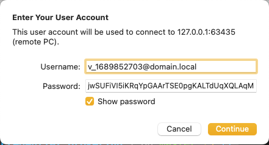
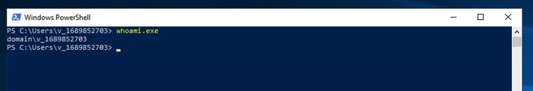
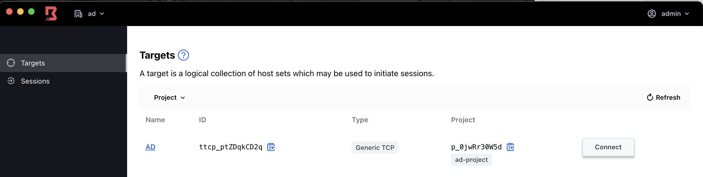
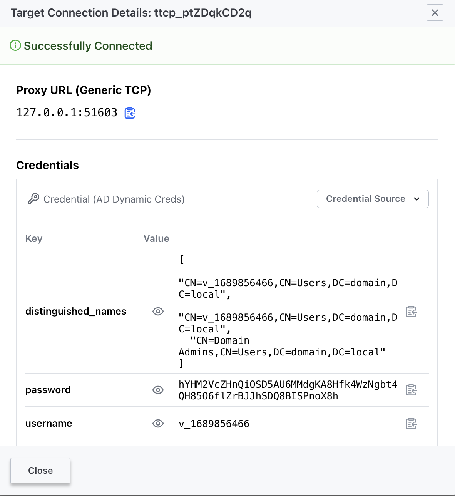
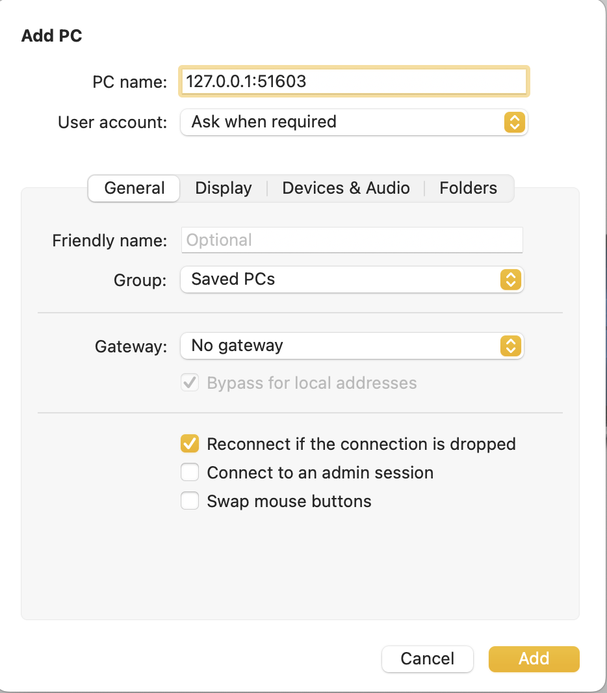
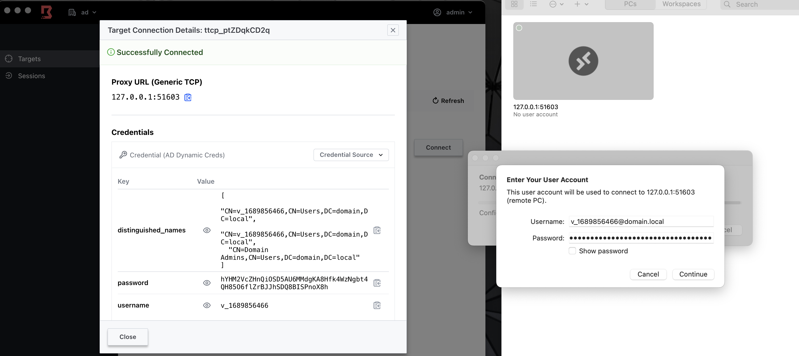
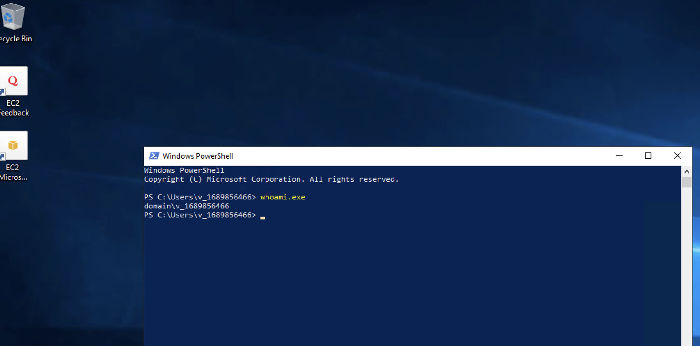
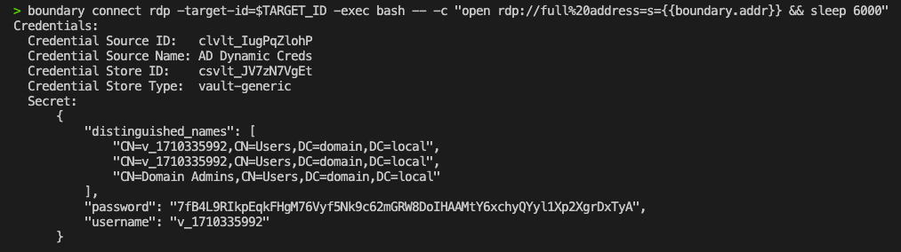

# [Scenario 2b] Steps to Create Dynamic Windows Users

As a bonus of the previous step we are going to convert our Windows Server instance into a Domain Controller and enable the LDAP Secret Engine to create dynamic credentials. Some of the steps outlined here are manual

## Create a Domain Controller

This is an example script to create a domain in a new forest

```powershell

# Set the variables for the installation
$domainName = "domain.local"
$adminUser = "Administrator"
$adminPassword = "<your-password->"


# Install Active Directory Domain Services role
Install-WindowsFeature -Name AD-Domain-Services -IncludeManagementTools

# Promote the server to a domain controller
$adminPasswordSecure = ConvertTo-SecureString -String $adminPassword -AsPlainText -Force
Install-ADDSForest `
    -DomainName $domainName `
    -DomainNetbiosName ($domainName -split '\.')[0] `
    -DomainMode Win2012R2 `
    -ForestMode Win2012R2 `
    -DatabasePath "C:\Windows\NTDS" `
    -LogPath "C:\Windows\NTDS" `
    -SysvolPath "C:\Windows\SYSVOL" `
    -InstallDns `
    -SafeModeAdministratorPassword $adminPasswordSecure `
    -NoRebootOnCompletion:$true `
    -Force:$true


# Restart the server
Restart-Computer -Force
```

Once installed and after the reboot, let's create a user that will be used by Vault to connect to the LDAP server

> It takes a while for the Domain Controller to obtain the Group Policy Client

```powershell
# Set the variables for the user
$username = "john"
$password = ConvertTo-SecureString -String "<your-password>" -AsPlainText -Force

# Create the user
New-ADUser -SamAccountName $username -UserPrincipalName "$username@domain.local" -Name $username -GivenName $username -Surname "Doe" -Enabled $true -PasswordNeverExpires $true -AccountPassword $password


# Add the user to the Domain Admins group
Add-ADGroupMember -Identity "Domain Admins" -Members $username
```

## Enable LDAPS

To enable LDAPS, you can follow the steps in this tutorial: [https://www.youtube.com/watch?v=xC3ujXGkh_c]()

Basically, you will be installing Windows CA and then rebooting the server.

```bash
# Install Certificate Authority
Install-WindowsFeature -Name ADCS-Cert-Authority -IncludeManagementTools
Install-AdcsCertificationAuthority -CAType EnterpriseRootCA

# Restart the server
Restart-Computer -Force
```

## Vault Configuration

We are integrating Vault with AD via LDAP Secret Engine. To that end we have to:

1. Enable the secret engine

   ```
   vault secrets enable ldap
   ```
2. Configure the secret engine to use the user we previously created

   ```bash
   vault write ldap/config binddn="CN=john,CN=Users,DC=domain,DC=local" bindpass=<password> url=ldaps://$(terraform output -raw targetWindows_privateIP) schema=ad insecure_tls=true
   ```
3. Create the role that will be used to create the users

   ```bash
   vault write ldap/role/dynamic-role creation_ldif=@Dynamic_Credentials_Windows/creation.ldif deletion_ldif=@Dynamic_Credentials_Windows/deletion.ldif rollback_ldif=@Dynamic_Credentials_Windows/deletion.ldif default_ttl=1h max_ttl=24h username_template="v_{{unix_time}}"
   ```
4. Finally we can test to create a user

   ```bash
   vault read ldap/creds/dynamic-role


   Key                    Value
   ---                    -----
   lease_id               ldap/creds/dynamic-role/DJHlGpyZZUMujcnJELXelY6u.c2sG1
   lease_duration         1h
   lease_renewable        true
   distinguished_names    [CN=v_1689852703,CN=Users,DC=domain,DC=local CN=v_1689852703,CN=Users,DC=domain,DC=local CN=Domain Admins,CN=Users,DC=domain,DC=local]
   password               jwSUFiVI5iKRqYpGAArTSE0pgKALTdUqXQLAqMakidwnwxYVvzf0MTbkqPrUQ9Jb
   username               v_1689852703
   ```

This user can log into the Windows Server





This works, but now we have to make it usable by Boundary. For which we need a token and an associated policy.

### Create the Policy

```bash
vault policy write windows-ad Dynamic_Credentials_Windows/windows_dynamic.hcl
```

The policy simply provides read access to the path (`ldap/creds/dynamic-role`)

### Create the token

```bash
export CRED_STORE_TOKEN=$(vault token create \
  -no-default-policy=true \
  -policy="boundary-controller" \
  -policy="windows-ad" \
  -orphan=true \
  -period=20m \
  -renewable=true \
  -field=token -format=json | jq -r .)
```

## Boundary Configuration

Using this tutorial as reference ([https://developer.hashicorp.com/boundary/tutorials/credential-management/hcp-vault-cred-brokering-quickstart]()) apply the following configuration

```bash
export SCOPE_ID=$(terraform output -raw demo_scope)
export PROJECT_ID=$(boundary scopes create -scope-id $SCOPE_ID -name Scenario2b_ad-project -format=json | jq -r .item.id)
export HOST_CATALOG_ID=$(boundary host-catalogs create static -scope-id=$PROJECT_ID -name=ad-catalog -format=json | jq -r .item.id)
export HOST_SET_ID=$(boundary host-sets create static -name=ad-host-set -host-catalog-id=$HOST_CATALOG_ID -format=json  | jq -r .item.id)
export WIN_HOST=$(terraform output -raw targetWindows_publicIP)
export AD_HOST_ID=$(boundary hosts create static \
-name=ad-host \
-description="ad host" \
-address=$WIN_HOST \
-host-catalog-id=$HOST_CATALOG_ID -format=json | jq -r .item.id)
boundary host-sets add-hosts \
-id=$HOST_SET_ID \
-host=$AD_HOST_ID
export TARGET_ID=$(boundary targets create tcp \
  -scope-id $PROJECT_ID \
  -default-port=3389 \
  -session-connection-limit=-1 \
  -name "Scenario2b_AD" -format=json | jq -r .item.id)
boundary targets add-host-sources -host-source=$HOST_SET_ID -id=$TARGET_ID
export CRED_STORE_ID=$(boundary credential-stores create vault -scope-id $PROJECT_ID \
  -vault-address $VAULT_ADDR \
  -vault-token $CRED_STORE_TOKEN \
  -vault-namespace $VAULT_NAMESPACE -format=json | jq -r .item.id)
export AD_CRED_LIB_ID=$(boundary credential-libraries create vault-generic \
    -credential-store-id $CRED_STORE_ID \
    -vault-path "ldap/creds/dynamic-role" \
    -name "AD Dynamic Creds" -format=json | jq -r .item.id)
boundary targets add-credential-sources \
  -id=$TARGET_ID \
  -brokered-credential-source=$AD_CRED_LIB_ID
export ALIAS="scenario2.ad.winrdp.boundary.demo"
boundary aliases create target -value $ALIAS -name winrdp.ad -description "Dynamic Credential alias for AD"   -destination-id=$TARGET_ID
```

If we refresh our Boundary Desktop we will see a new org with a new target



Click in connect



With this information we can go to our RDP client





After login we can check the id of the user.



Or via CLI

```bash
boundary connect rdp -target-id=$TARGET_ID -exec bash -- -c "open rdp://full%20address=s={{boundary.addr}} && sleep 6000"
# Using Target Alias
boundary connect rdp $ALIAS -exec bash -- -c "open rdp://full%20address=s={{boundary.addr}} && sleep 6000"
```



## Clean up

```bash
boundary scopes delete -id=$SCOPE_ID
vault secrets disable ldap
vault policy delete windows-ad
```
