# Boundary and Auth0 - OIDC Integration

Let's create an Auth0 dev Org where the first step would be to create an Application with access to Auth0 MGMT API. Its free :)

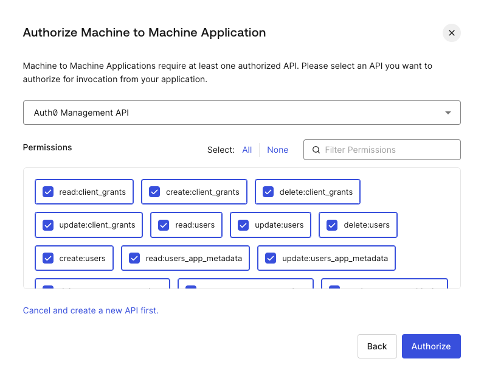

This attributes will have to be set as enviromental variables

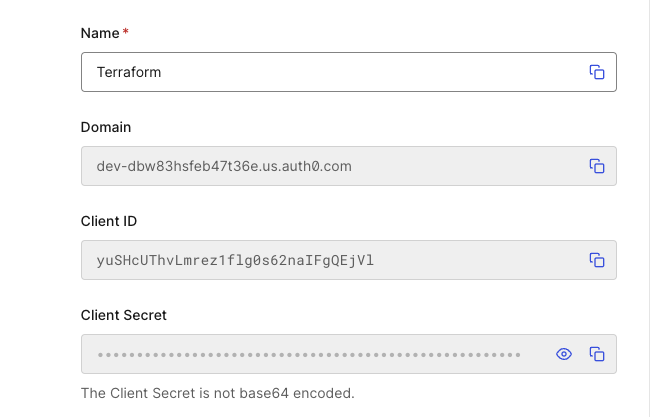

```bash
export AUTH0_DOMAIN="<domain>"
export AUTH0_CLIENT_ID="<client-id>" 
export AUTH0_CLIENT_SECRET="<client_secret>"
```

Now what we are going to do is Terraform the content of these two guides:

* [https://developer.hashicorp.com/boundary/tutorials/identity-management/oidc-auth](https://developer.hashicorp.com/boundary/tutorials/identity-management/oidc-auth)
* [https://developer.hashicorp.com/boundary/tutorials/identity-management/oidc-idp-groups](https://developer.hashicorp.com/boundary/tutorials/identity-management/oidc-idp-groups)

In Auth0 we are going to create an Application that will be used by Boundary to connect and four users that will be mapped to user/accounts in Boundary.

**Application Config:**

---

```bash
resource "auth0_client" "boundary" {
  name                = "Boundary"
  description         = "Boundary"
  app_type            = "regular_web"
  callbacks           = ["${data.terraform_remote_state.local_backend.outputs.boundary_public_url}/v1/auth-methods/oidc:authenticate:callback"]
  allowed_logout_urls = ["${data.terraform_remote_state.local_backend.outputs.boundary_public_url}:3000"]
  oidc_conformant     = true

  jwt_configuration {
    alg = "RS256"
  }
}
```

**User Config:**

---

```bash
resource "auth0_user" "user" {
  for_each = {
    "random1" = random_string.random[0].result
    "random2" = random_string.random[1].result
    "random3" = random_string.random[2].result
    "random4" = random_string.random[3].result
  }
  connection_name = "Username-Password-Authentication"
  name           = "${var.auth0_name}${each.value}"
  email          = "${var.auth0_name}${each.value}@boundaryproject.io"
  email_verified = true
  password       = var.auth0_password
}
```

Given we are using a random string to create the user and email address of our users we are printing the log-in details via output.

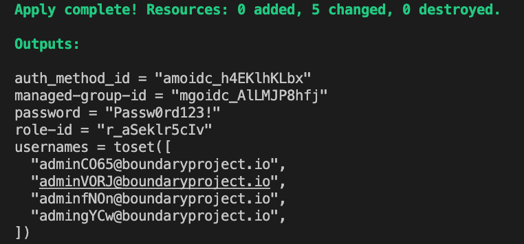

To run the code simply:

```bash
cd BONUS/RBAC/OIDC
terraform init
terraform apply -auto-approve
```

We will create a child scope `OIDC-org` that will be associated with this auth-method.

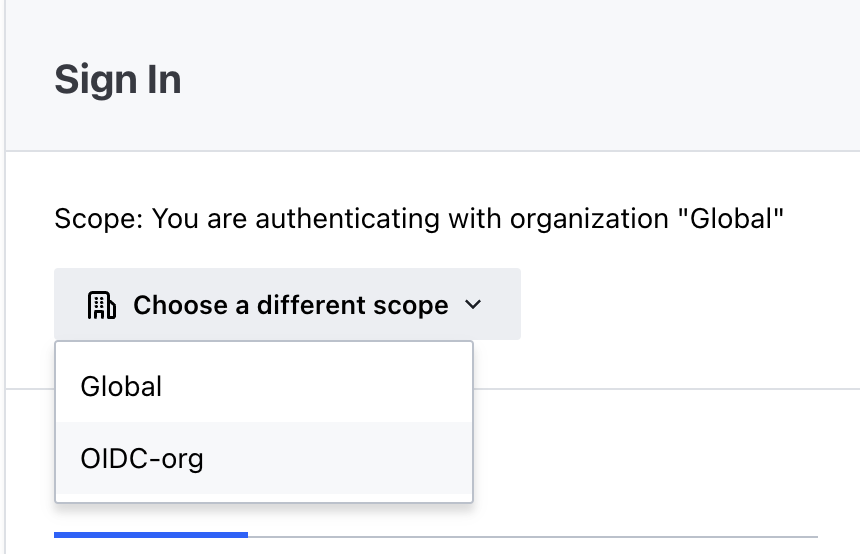

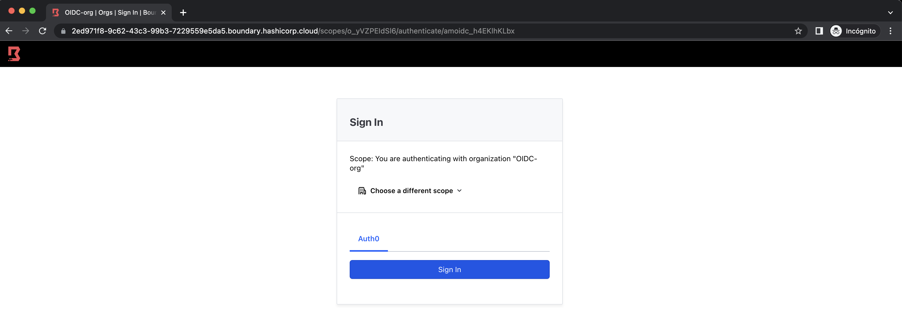

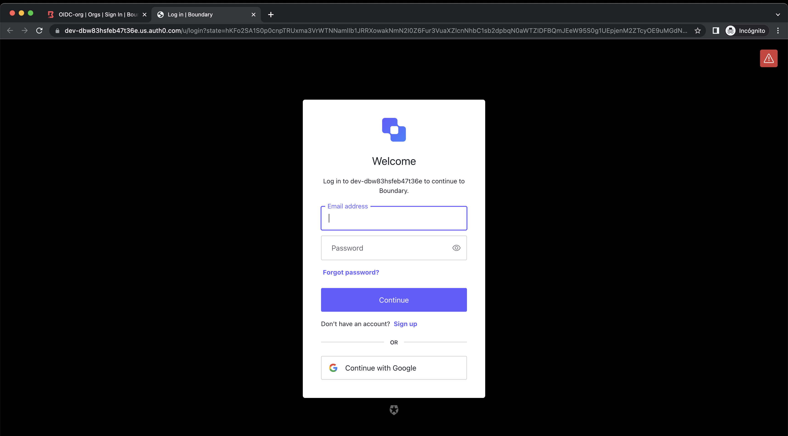

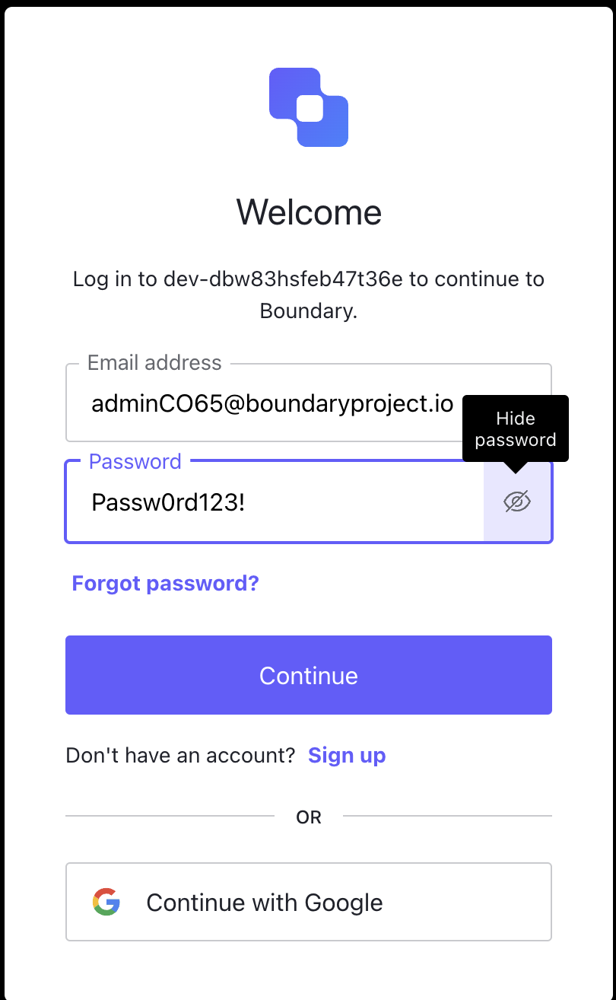

After this you can access Boundary Web Interface

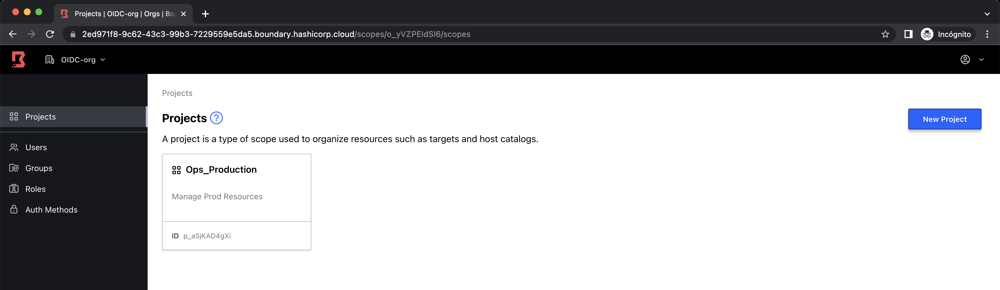

With the users created based on what we have created in Auth0

|  | 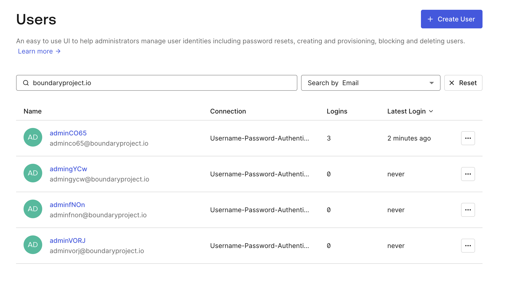 |
| ------------------------------------------------------------------------------------------------------------------------------------------------------ | ---------------------------------------------- |

We have played with roles (permissions).

Users are given full-admin permissions at child-org level

| Users role                                     | Group role                                     |
| ---------------------------------------------- | ---------------------------------------------- |
| 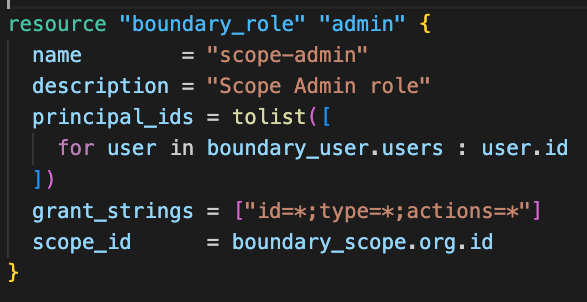 | 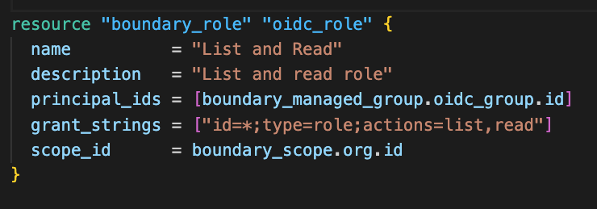 |

## Clean Up

```bash
terraform destroy -auto-approve
```
