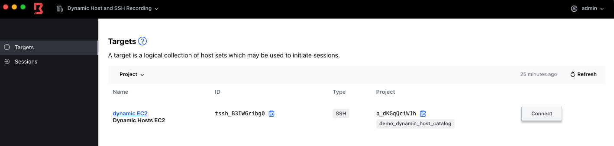
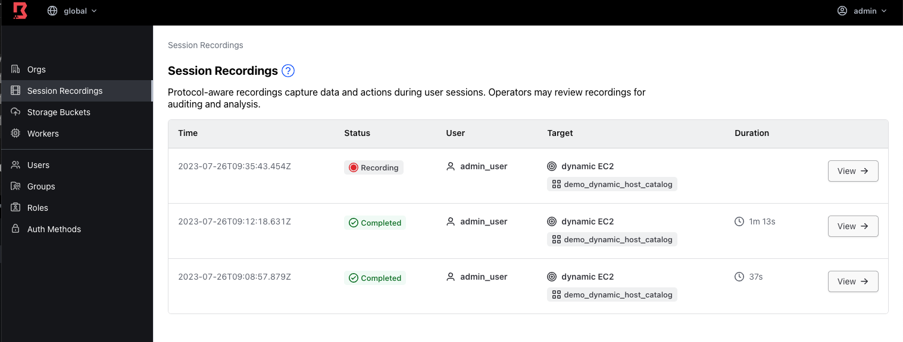

# SSH Session Recording

This repo make uses of boundary_team_acctest_dev and associated repo. Using that as basis we have created a Boundary Org, project, targets using AWS plugins. We have also created the resources in Boundary to make use of SSH Session Recording:

* PKI Worker
* Storage Bucket
* SSH Target
* SSH Injected Secret using Boundary Credential Storage

```bash
cd boundary-aws-demo-stack/
cp <aws_cred>
terraform init
terraform apply -auto-approve
terraform output -raw instance_ssh_private_key > key.pem && chmod 400 key.pem
```

This will create a new Org in our Boundary Cluster with a single target (making use of Dynamic Host)



We can connect as usual. Once done, if we go to Boundary web UI we can see the recordings in the Global Org


