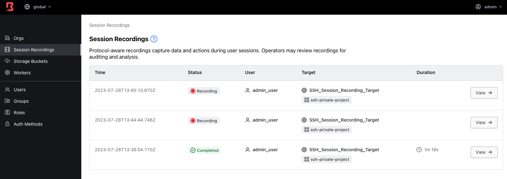
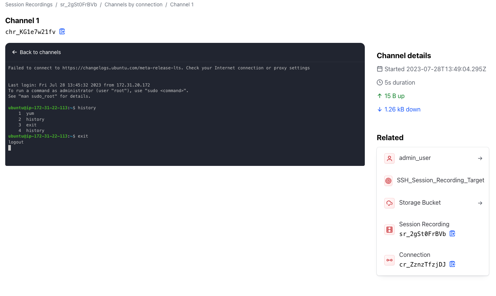

# SSH Session Recording

This repo make uses of boundary_team_acctest_dev and associated repo. Using that as basis we have created a Boundary Org, project, targets using AWS plugins. We have also created the resources in Boundary to make use of SSH Session Recording:

* PKI Worker
* Storage Bucket
* SSH Target
* SSH Injected Secret using Boundary Credential Storage
* Integration with Vault for SSH Secret Injection

The Demo Stack is being modified to just create the resources required for Session Recording

```bash
cd BONUS/Session_Recording/boundary-aws-demo-stack
cp <aws_cred>
terraform init
terraform apply -auto-approve
```

The Second step consist in creating the Boundary and Vault configuration, together with the resources (target)

```
cd ../PKI_Worker
cp ../../../4_Vault_SSH_Injection/vault_ca.pub .
terraform apply -auto-approve
```

This will create a new Org in our Boundary Cluster with a single target


We can connect as usual. Once done, if we go to Boundary web UI we can see the recordings in the Global Org







## Clean Up

```bash
cd ../boundary-aws-demo-stack
<cp AWS Creds>
terraform destroy -auto-approve
unset AWS_ACCESS_KEY_ID
unset AWS_SECRET_ACCESS_KEY
unset AWS_SESSION_TOKEN
cd ../PKI_Worker
<cp AWS Creds>
terraform destroy -auto-approve
```
