# Boundary Demo

The content of this demo is the result of Terraforming several of the Boundary and HCP Learn Tutorials with a few additions along the way

# 1. Building Vault and Boundary clusters in HCP

The "Plataforma" directory contains the code to build a Vault and Boundary cluster in HCP together with a VPC in your AWS account. That VPC gets connected to HCP (where Vault is deployed) by means of a VPC peering with an HVN. After deploying the infrastructure we set a number of environmental variables that are required for the upcoming deployments. Finally, we authenticate with Boundary using the credentials we have defined within the `terraform.tfvars` file. Vault cluster is configured to send logs to Datadog.

```bash
cd 1_Plataforma/

<export AWS Creds>
terraform init
terraform apply -auto-approve
terraform output -json > data.json
export BOUNDARY_ADDR=$(cat data.json | jq -r .boundary_public_url.value)
export VAULT_ADDR=$(cat data.json | jq -r .vault_public_url.value)
export VAULT_NAMESPACE=admin
export VAULT_TOKEN=$(cat data.json | jq -r .vault_token.value)
boundary authenticate
```

# 2. Build an EC2 and access via Boundary

The second steps consist on an EC2 instance deployed in a Public subnet (not quite the use case for Boundary). We are going to create a public key that will be associated to the instance and at the same time will be assigned to a Static Credential Store within Boundary. We are also going to build a route table that will connect the subnet where we are deploying the instance with HCP HVN.

```bash
cd ../2_First_target
terraform init
# We will be creating first the key
terraform apply -auto-approve -target=aws_key_pair.ec2_key -target=tls_private_key.rsa_4096_key
# Then the rest of the configuration
terraform apply -auto-approve
```

Once we have deployed the infrastructure, we check we can access the instance

```bash
ssh -i cert.pem ubuntu@$(terraform output -json | jq -r .target_publicIP.value)
```

And then we proceed to access via Boundary. When we use the Static Credential Store we cannot do "Credential Brokering", but "Credential Injection", which is visible using the Desktop client. To log in with the Desktop client we need Boundary URL and the credentials we defined previously.


As you can see, when we use the Desktop client a tunnel session gets opened and credentials are presented. Credentials are of SSH Key type.


They key above is the same we used previosly to log in to the client, so there is no need to copy that content and build a new file, thus, we are going simply to re-use the cert created thru the boundary tunnel

```bash
ssh ubuntu@127.0.0.1 -p 49165 -i cert.pem
```

Things get even simpler using the boundary client. In the first step we logged into Boundary using administrative credentials

```bash
# Retrieve list of targets for all scopes
boundary targets list -recursive
# Connect to the target in question once we have identified the target-id
boundary connect ssh -target-id=<id>
```


Here we are making use of a "[Connection helper](https://developer.hashicorp.com/boundary/docs/hcp/get-started/connect-to-target#use-connect-helpers)" which will take care of passing the private key and username to the [local ssh client](https://developer.hashicorp.com/boundary/docs/hcp/get-started/connect-to-target#ssh).

# 3.  Vault Credential Brokering

In this step we are going to:

1. Crear an Ubuntu instance where we are going to deployed a Postgres DB and an instance (named `northwind`). This configuration is based on this tutorial: [https://developer.hashicorp.com/boundary/tutorials/credential-management/hcp-vault-cred-brokering-quickstart](https://developer.hashicorp.com/boundary/tutorials/credential-management/hcp-vault-cred-brokering-quickstart). Vault is going to managed the creation of accounts by means of a "Database Secret Engine" connecting via the private endpoint.
2. We are going to install a Windows Server and use Boundary to open a tunnel to access via RDP. Credentials will be stored in Vault using a KV Engine.

Vault configuration will take place thanks to the environmental variables we defined in the first step (`VAULT_ADDR`, `VAULT_NAMESPACE`, `VAULT_TOKEN`)

To avoid building pre-conditions and adding some delay on the resource creation we are going to simply create the two instances and the the rest of the configuration.

```bash
cd ../3_Vault_Credential_Brokering
terraform init
# We build first the two EC2 instances
terraform apply -auto-approve -target=aws_instance.postgres_target -target=aws_instance.windows-server
# Then the Vault and Boundary configuration
terraform apply -auto-approve
```

For the db access we have created two different roles in Vault with their correspondent path/endpoints. This translates into two targets for the same host, that are feed by two separate Credential Libraries

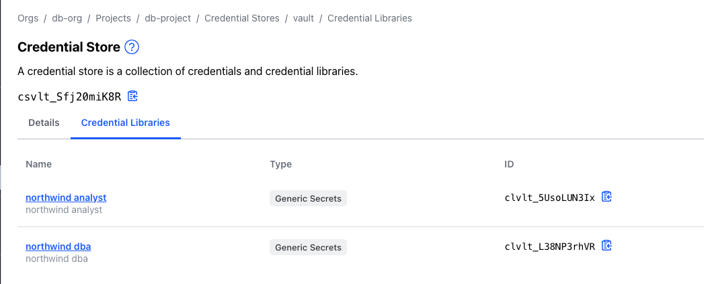

This is simpler to see based on the Terraform code

```bash
resource "boundary_credential_library_vault" "dba" {
name                = "northwind dba"
description         = "northwind dba"
credential_store_id = boundary_credential_store_vault.vault.id
path                = "database/creds/dba"# change to Vault backend path
http_method         = "GET"
}
resource "boundary_credential_library_vault" "analyst" {
name                = "northwind analyst"
description         = "northwind analyst"
credential_store_id = boundary_credential_store_vault.vault.id
path                = "database/creds/analyst"# change to Vault backend path
http_method         = "GET"
}
```

After the deployment we need to "Refresh" the Boundary Desktop Client to obtain the list of new scopes and targets. After this we can check access to the database using the different roles.

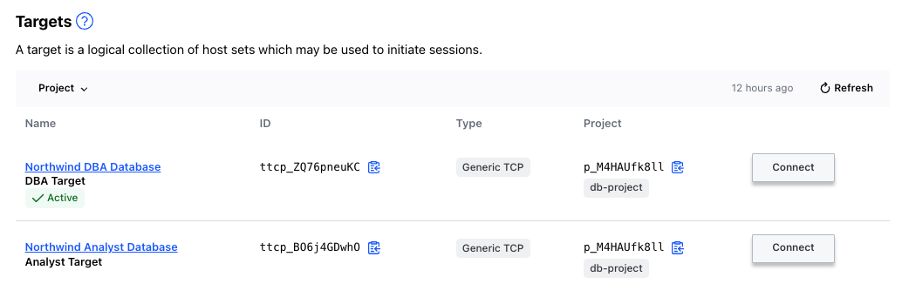

Here we are connecting using the "Northwind DBA Database" target


To leverage the tunnel we need to use a postgres client and set it up to use the localhost and local port, together with the username and password obtained via Vault.

```bash
psql -h 127.0.0.1 -p 54229 -U v-token-to-dba-caBAedEO2ShtIVxXd3NM-1689081824 -d northwind
```

Again, this is simpler if we use the Boundary CLI client, since the built-in postgres wrapper trigger the [local postgres client](https://developer.hashicorp.com/boundary/docs/hcp/get-started/connect-to-target#postgres) with the (brokered credentials) retrieved from Vault

```bash
boundary connect postgres -target-id <id> -dbname northwind
```

On the other hand, we have deployed a Windows Server that have been configured with IIS. On that basis, we can test a couple of access methods, not just RDP but also HTTP access. To that end, we have build to separate targets that points to two different ports.

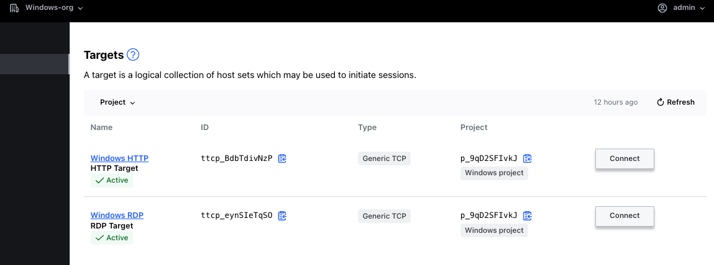

To access the IIS server running on the Windows host, we simply click on the Connect Button and copy the address retrieved, that has to be pasted in a browser.

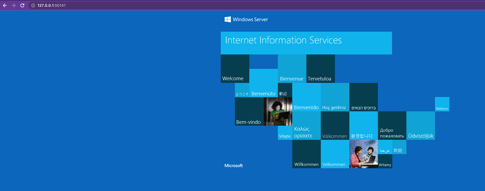

The session can be controlled via means of the Boundary client.

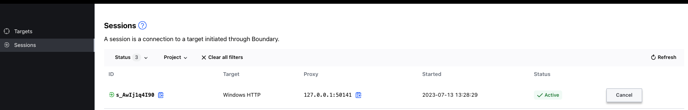

In the same fashion, we can open a tunnel session against the RDP target.

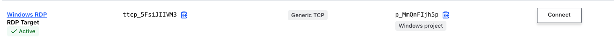

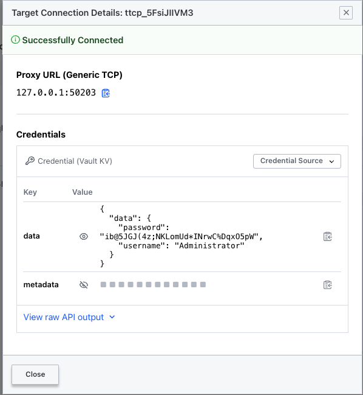

Using this info, we proceed with configuring our RDP client.

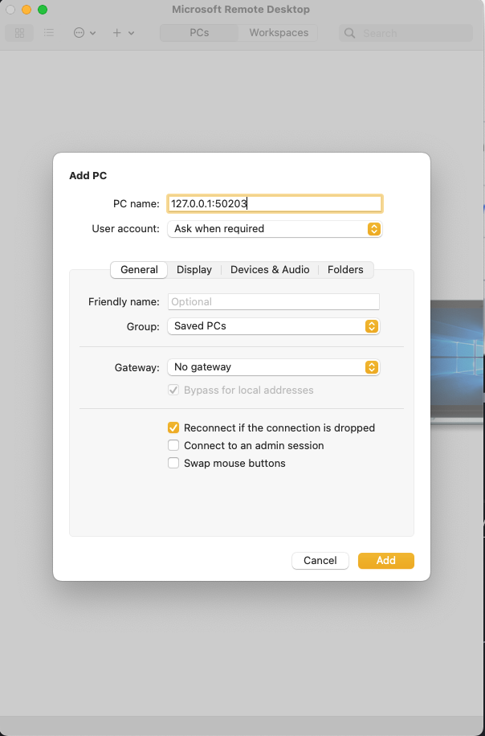

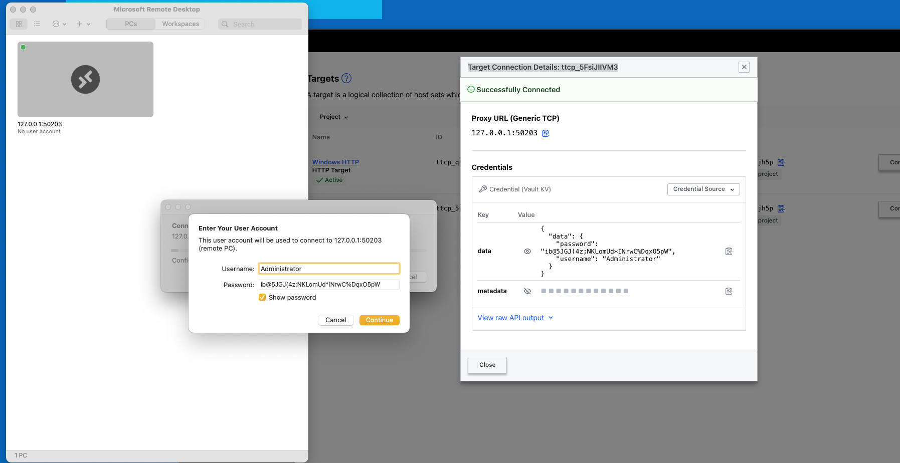

Then simply we initiate a connection towards that "PC"

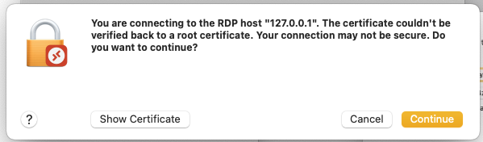

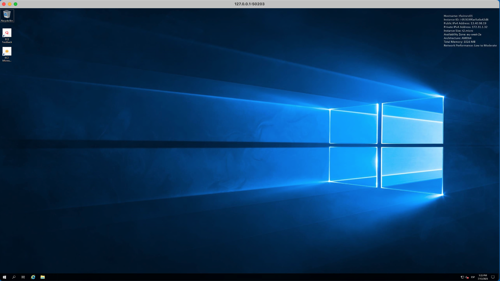

# 4.  SSH Certificate Injection

In this instance we are going to create an SSH Secret Engine in Vault from which we are going to obtained a CA public key. This CA public key is going to be deployed within the EC2 instance as "Trusted CA". This way the certificates generated by Vault will be trusted by the EC2 host.

```bash
cd ../4_Vault_SSH_Injection/vault_config
terraform init
terraform apply -auto-approve
cd ..
terraform init 
terraform apply -auto-approve
```

After deployment and once we have refresh our Boundary Desktop client we will see a new scope and target. Vault SSH credentials are injected in this case, and so, the user will not have to do anything in terms of public key management.


To connect with the local SSH client we have to simply connect to the localhost and local port.

```bash
ssh 127.0.0.1 -p 56533
```

The approach using the Boundary CLI client, remains the same

```bash
boundary connect ssh -target-id=<id>
```

# 5.  Self Managed Worker

In this step we are going to create a Self-Managed worker on an Ubuntu machine. This host will be deployed in a public subnet that will have connectivity with a private subnet where we are going to deployed another Ubuntu instance, that is configured to trust the Vault CA created in the previous step.

The connectivity between Boundary and Vault will be moved from the public to Vault private endpoint using the Worker as proxy (`worker_filter`).

```bash

resource "boundary_credential_store_vault" "vault" {
name        = "certificates-store"
description = "My second Vault credential store!"
address     = data.terraform_remote_state.local_backend.outputs.vault_public_url
address     = data.terraform_remote_state.local_backend.outputs.vault_private_url
token       = vault_token.boundary_token.client_token
scope_id    = boundary_scope.project.id
namespace   = "admin"
# Adding worker filter to send request to Vault via Worker, worker that has access to Vault via HVN peering
worker_filter =" \"worker1\" in \"/tags/type\" "
# Introducing some delay to let the worker start up
depends_on =[ null_resource.delay ]
}
```

To deploy the infrastructure and configuration

```bash
cd ../5_Self_Managed_Worker/
terraform init
cp ../4_Vault_SSH_Injection/vault_ca.pub vault_ca.pub
terraform apply -auto-approve
```


The result of this configuration will be a new scope (`ssh-private-org`) and target (`ssh-target-private`)

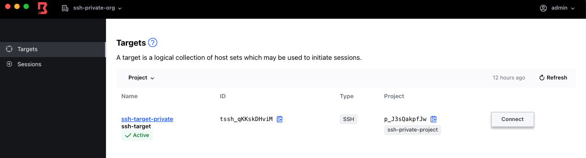

> Note: 


# 6.  Multi Hop

```bash
cd ../6_Multi_hop/
terraform init
cp ../\#4_Vault_SSH_Injection/vault_ca.pub vault_ca.pub
terraform apply -auto-approve
```

En este caso para que funcione el egress worker con un ingress worker tenemos que modificar la configuración del `downstream_worker.tf` para que dicho worker apunte correctamente


en el caso previo, el worker que instalamos se registraba contra el control plane directamente mientras que en este caso, el worker se registra via uno de los managed workers, que en este caso actúa como upstream worker.
